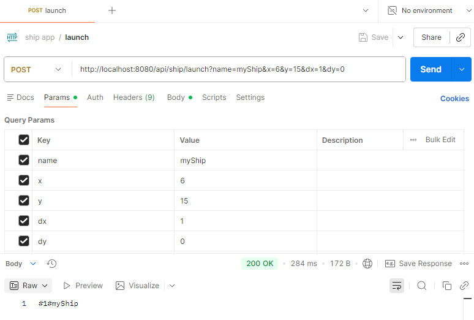
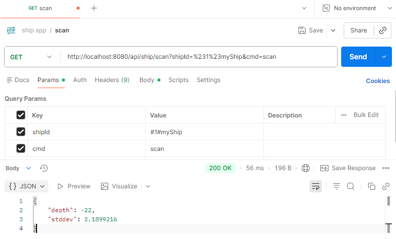
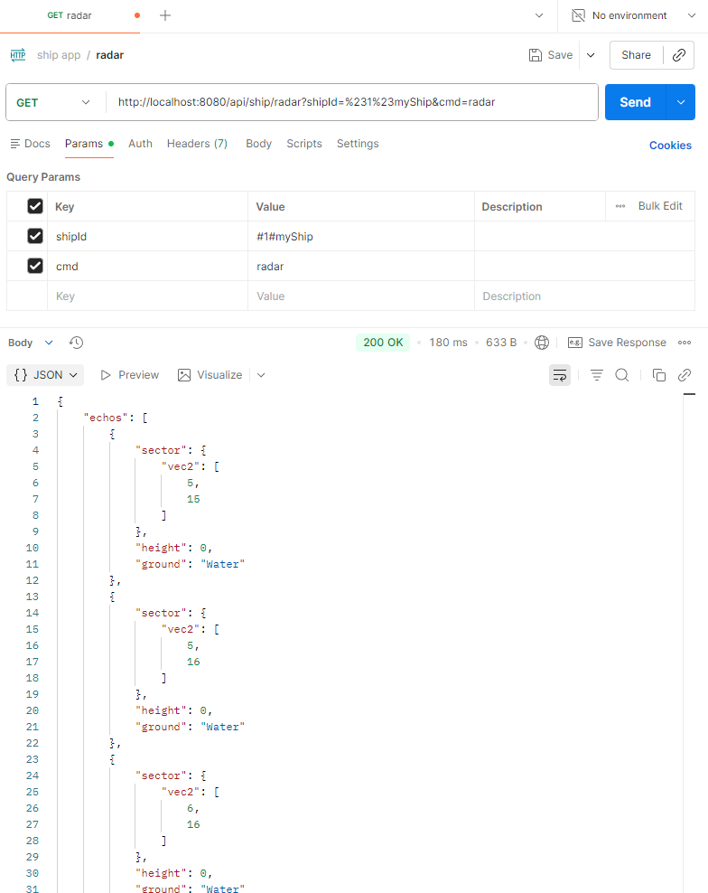
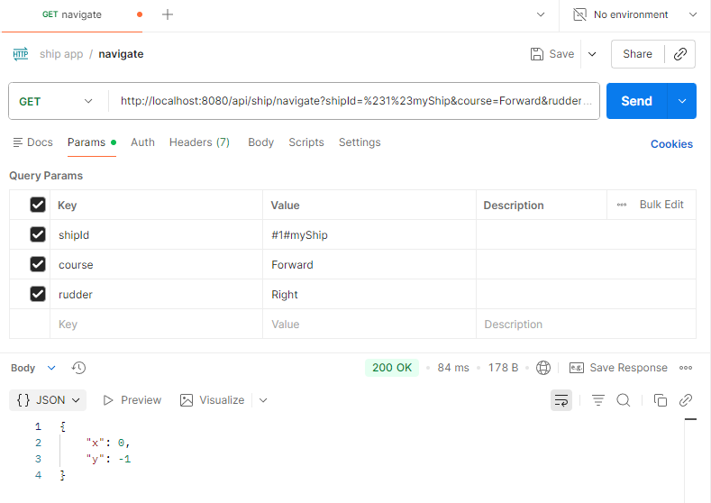
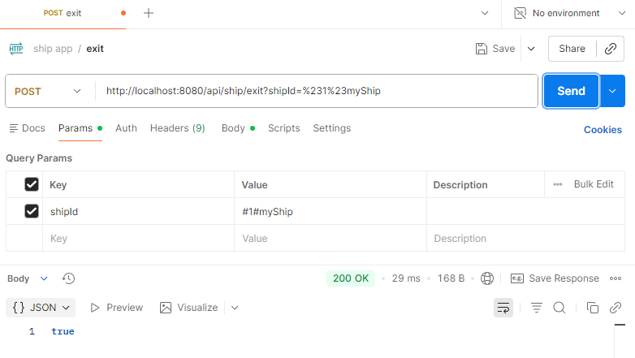
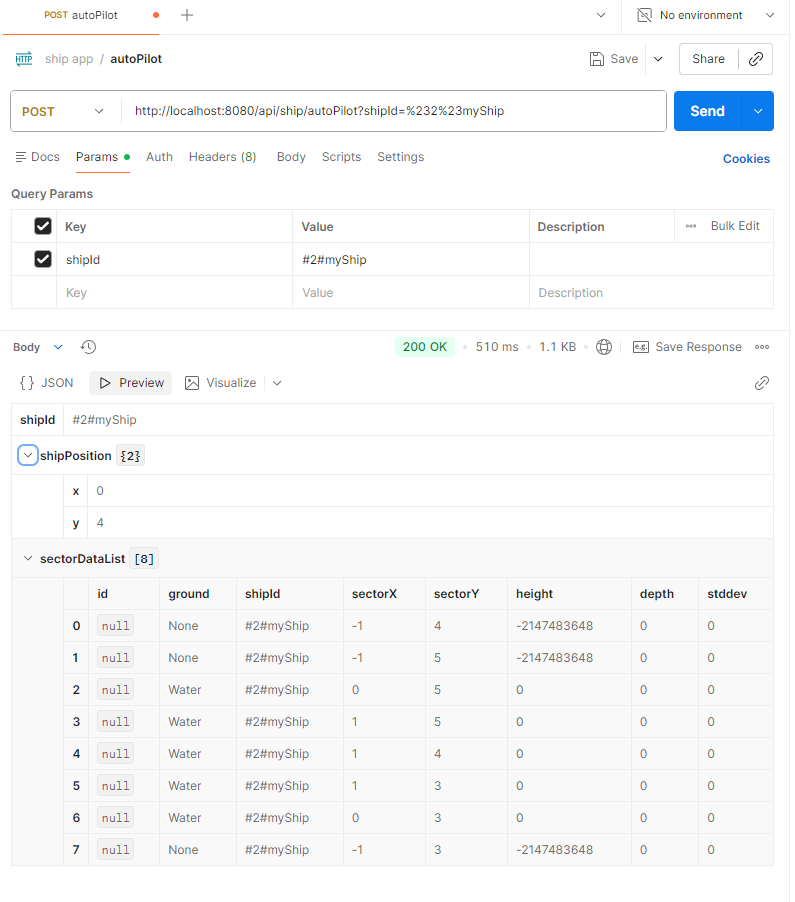
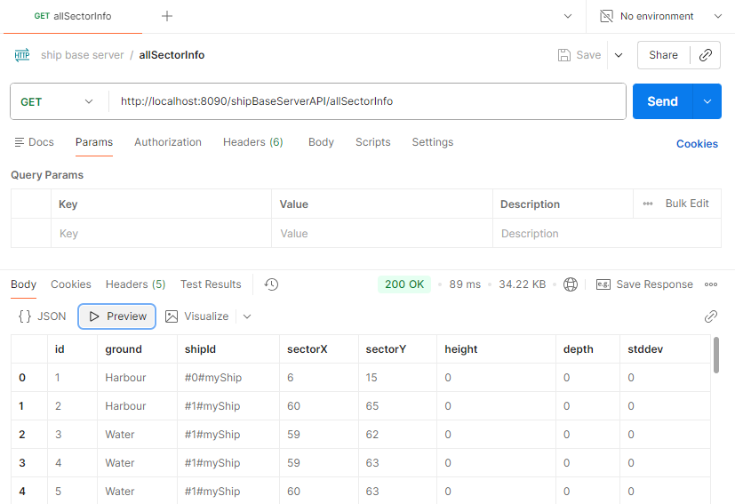
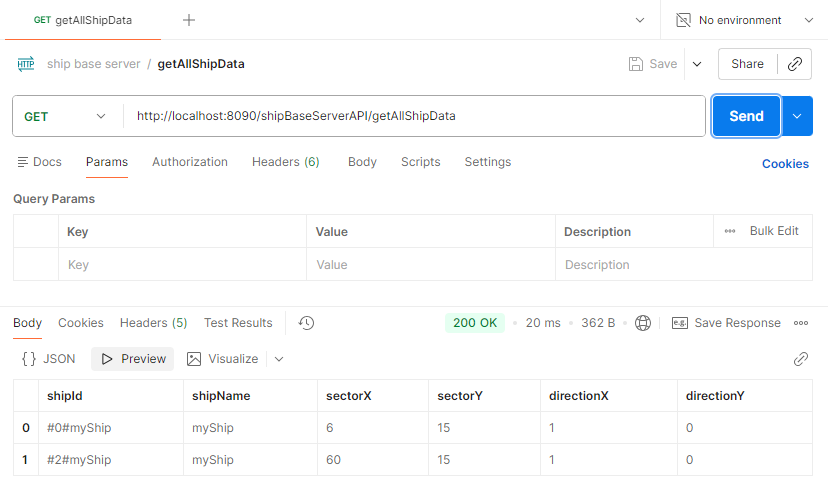
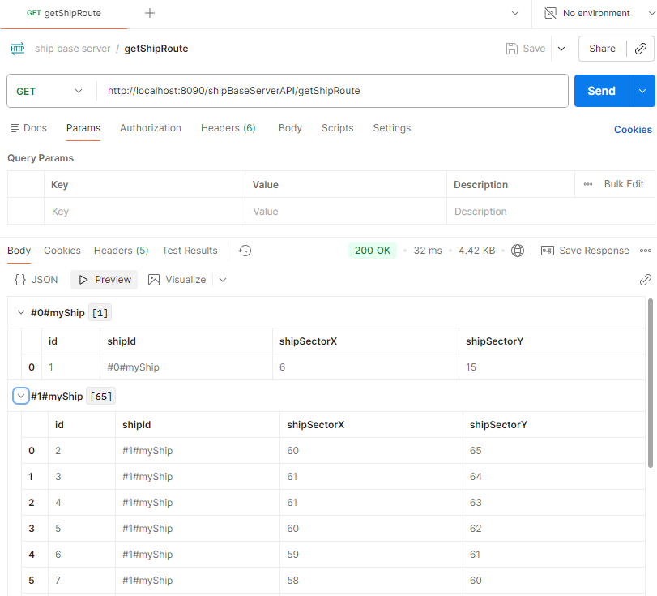
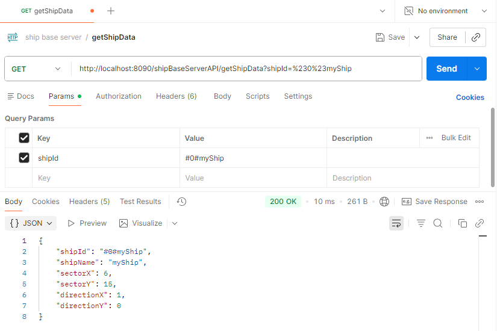

# 🎯 Overview

This project defines a **JSON-based communication protocol** between the **OceanServer (Server)** and the **ShipApp (
Client)**.

The **ShipApp** sends commands such as launching, navigating, scanning sectors, or requesting radar data.  
The **OceanServer** processes these commands, updates the game state, and responds with information like positions,
sensor results, status messages, or crash events.

Additionally, the **ShipBaseServer** runs as a **microservice** that collects data from all ShipApps, stores it in a *
*MySQL database**, and provides **REST APIs** for querying the stored data via a **web browser or tools like Postman**.

# ✨ Features

1. **Client starts ship (`launch`)**  
   The client sends the ship name, ship type, starting sector, and direction to the server.

2. **Server confirms launch (`launched`)**  
   The server creates the ship and returns the **ShipID** and the **absolute starting position**.

3. **Client moves the ship (`navigate`)**  
   The client controls the ship using rudder position and movement direction.  
   The server calculates the new position.

4. **Server sends position update (`move2d`)**  
   After a movement, the server returns the **new sector**, **direction**, and **absolute position**.

5. **Sensor requests (`scan` or `radar`)**
    - `scan` returns depth information for the current sector
    - `radar` returns information about surrounding sectors

6. **Server messages (`message`, `crash`)**  
   The server sends status or error messages.  
   In case of an accident, a `crash` message is sent including the ship's sinking position.

7. **Client exits the game (`exit`)**  
   The ship is removed from the game by the server.

# 🛠️ Technologies Used

1. **Java 21**
2. **Spring Boot 3.5.5**
3. **IntelliJ IDEA**
4. **JPA**
5. **MySQL**
6. **Docker**
7. **Apache Tomcat**
8. **Maven**
9. **REST**

# 🚀 How to Run

### Create a container from the official MySQL Docker Image:

    docker run -d --name ocean-mysql -e MYSQL_ROOT_PASSWORD=1234 -e MYSQL_DATABASE=ocean_explorer_db -p 3306:3306 mysql:8

### list all docker containers:

    docker ps -a

### Start container:

    docker start ocean-mysql

### start ocean-server (projekt_Unterlagen_von_Philip/ocean_explorer_v1.3/):

    1. java -jar oceanstarter.jar
    
    2. click on the start button

### run ShipBaseServerApplication

### run ShipApplication

# Send Requests to ShipApp

You can test the **Ocean Explorer server** using Postman by following these steps:

### 1. Launch request

---

### 2. Scan request

---

### 3. radar request

---

### 4. navigate request

---

### 5. exit request

---

### 6. autoPilot request

---

# Send Requests to ShipBaseServer

You can test the **Ocean Explorer server** using Postman by following these steps:

### 1. GET allSectorInfo request

---

### 2. GET getAllShipData request

---

### 3. GET getShipRoute request

---

### 4. GET getShipData request

---

### 💡 Tips

- Use the following base URL for requests: `http://localhost:8080` (replace with your server's URL if different).
- Set the request method (GET, POST, etc.) according to the API endpoint you want to test.